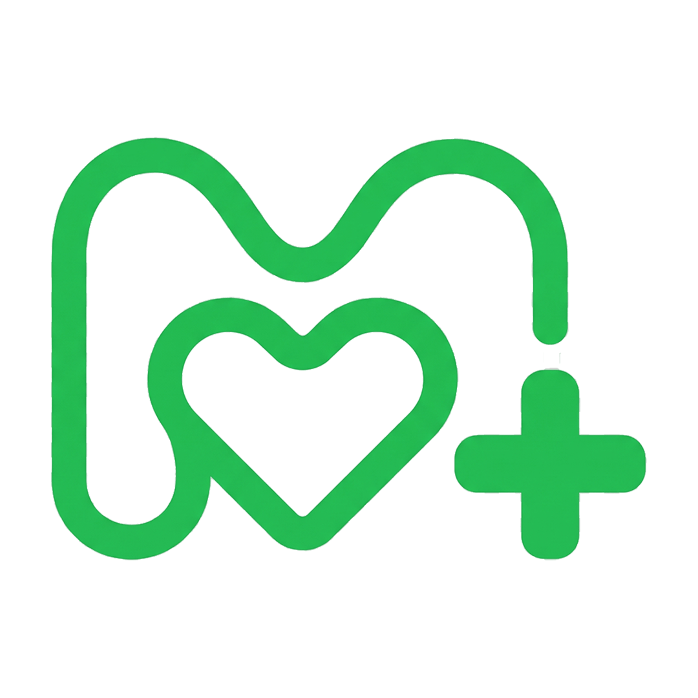

<div align="center">
  
  <h1>Medly</h1>
  <p><strong>Your Comfort and Care Companion</strong></p>
  <p>
    <em>Satu layar di sisi tempat tidur yang membuat rawat inap terasa lebih manusiawi.</em>
  </p>

  <br />

  <a href="https://medly-nine.vercel.app"></a>
  &nbsp;
  <a href="https://youtu.be/UCbUyGB-ifA?si=SCA7FTuSSx3oygFA"></a>
  &nbsp;
  <a href="https://github.com/riyqnn/medly"></a>

  <br /><br />

  
  
  
  
  
</div>

---

## 💡 Inspiration

Hospital stays are designed around clinical workflows, not the patient experience. Patients spend hours wondering when their doctor will arrive, when medication is scheduled, or how to request help beyond pressing a generic nurse call button.

That traditional call button creates another challenge — every request looks identical until a nurse reaches the room, making it impossible to prioritize or prepare.

> *What if the tablet beside every hospital bed became a true digital companion instead of just another screen?*

That question inspired **Medly**.

---

## 🩺 What it does

Medly transforms the bedside tablet into a **centralized patient experience platform**.

### For Patients
| Feature | Description |
|---|---|
| 🔔 **Smart Nurse Call** | Request specific assistance — pain support, empty IV, bathroom help, drinking water, extra blanket |
| 📅 **Treatment Timeline** | View medications, doctor visits, procedures, and scheduled care in one place |
| 📊 **Recovery Tracking** | Visual progress interface with daily checklists from the care team |
| 🍽️ **Meal Ordering** | Browse the daily diet menu, order independently, and track order status |
| 📚 **Health Education** | Personalized articles and videos curated to the patient's condition |
| 🎬 **Entertainment** | Films, music, podcasts, and relaxation content to fill the hours |
| 🕌 **Spiritual Care** | Prayer schedules, religious content, and spiritual resources |

### For Healthcare Staff
A lightweight **Hospital Information System (HIS)** dashboard enables staff to manage patients, treatment schedules, nurse requests, educational content, meal management, and hospital operations — all synchronized with the patient's bedside app in real time.

---

## 🏗️ How we built it

### Architecture

```
┌──────────────────────┐       ┌──────────────────────┐
│   Patient Bedside    │◄─────►│   Hospital Dashboard │
│   (Tablet UI)        │       │   (Staff HIS)        │
└──────────┬───────────┘       └──────────┬───────────┘
           │                              │
           └──────────┬───────────────────┘
                      │
              ┌───────▼────────┐
              │   Next.js API  │
              │   (Server)     │
              └───────┬────────┘
                      │
           ┌──────────▼──────────┐
           │  Supabase (Postgres │
           │  + Auth + RLS)      │
           └─────────────────────┘
```

### Tech Stack

| Layer | Technology |
|---|---|
| Framework | Next.js 16 (App Router + Turbopack) |
| Language | TypeScript (strict) |
| Database | PostgreSQL via Supabase |
| Auth | Supabase Auth + RBAC Middleware |
| Styling | Tailwind CSS 4 |
| File Storage | Pinata (IPFS) |
| Deployment | Vercel |

### Key Design Decisions

- **Patient App** — Large touch targets, clear navigation, simplified interactions suitable for elderly or post-operative patients
- **Hospital Dashboard** — Role-based (Admin / Doctor / Nurse) with real-time data sync
- **Admin-only onboarding** — No public registration; hospitals are created exclusively by the Medly Super Admin
- **Row-Level Security** — Every query is scoped to the user's hospital via Supabase RLS

---

## 🚀 Quick Start

### Prerequisites

- Node.js 18+
- pnpm

### Installation

```bash
git clone https://github.com/riyqnn/medly.git
cd medly
pnpm install
```

### Environment

Create a `.env` file:

```env
NEXT_PUBLIC_SUPABASE_URL=your_supabase_url
NEXT_PUBLIC_SUPABASE_ANON_KEY=your_anon_key
SUPABASE_SERVICE_ROLE_KEY=your_service_role_key
PINATA_JWT=your_pinata_jwt
NEXT_PUBLIC_PINATA_GATEWAY=https://your-gateway.mypinata.cloud/ipfs
```

### Run

```bash
pnpm dev
```

Open [http://localhost:3000](http://localhost:3000)

---

## 🔑 Demo Accounts

Use these credentials to explore the platform:

| Role | Email | Password |
|---|---|---|
| 🏥 Hospital Admin | `mayapada@hospital.id` | `hospital` |
| 🛡️ Medly Super Admin | `admin@medly.id` | `adminpassword123` |

> After logging in as Hospital Admin, you can create Doctor and Nurse accounts from the dashboard.

---

## 📂 Project Structure

```
medly/
├── app/
│   ├── api/              # API routes (REST endpoints)
│   ├── dashboard/
│   │   ├── admin/        # Super Admin panel
│   │   ├── hospital/     # Hospital staff dashboard
│   │   ├── doctor/       # Doctor portal
│   │   └── nurse/        # Nurse portal
│   ├── patient/          # Bedside tablet interface
│   ├── login/            # Authentication
│   └── page.tsx          # Landing page
├── src/
│   ├── features/
│   │   ├── auth/         # Auth actions, schemas, middleware
│   │   └── shell/        # Shared UI components
│   └── lib/              # Utilities
└── public/               # Static assets
```

---

## 🏆 Accomplishments

- ✅ Complete end-to-end patient-to-hospital workflow
- ✅ Reimagined the nurse call button into **contextual, prioritized requests**
- ✅ Treatment transparency through a patient-centered timeline
- ✅ Real-time meal ordering with diet-aware menus
- ✅ Role-based access control (Admin → Hospital → Doctor → Nurse → Patient)
- ✅ Scalable architecture ready for enterprise HIS integration

---

## 📖 What we learned

Healthcare innovation isn't always about introducing new medical technology.

Sometimes, the greatest impact comes from **reducing uncertainty**.

By giving patients visibility into their treatment journey and providing staff with clearer information about patient needs, communication becomes more efficient and the hospital experience becomes more reassuring.

---

## 🔮 What's next

| Feature | Status |
|---|---|
| AI-powered patient assistant | 🔜 Planned |
| Family communication portal | 🔜 Planned |
| Pharmacy integration | 🔜 Planned |
| Lab & radiology integration | 🔜 Planned |
| Smart room IoT controls | 🔜 Planned |
| Patient satisfaction analytics | 🔜 Planned |
| Enterprise HIS integration | 🔜 Planned |

Our long-term vision: become the **patient-facing digital layer** that makes hospitalization more transparent, connected, and human-centered.

---

## 🛠️ Built With

<div align="center">
  
</div>

---

## 📄 License

This project is licensed under the [MIT License](LICENSE).

---

<div align="center">
  <br />
  <strong>Medly</strong> — Patient-centered care, satu layar di sisi tempat tidur.
  <br /><br />
</div>
